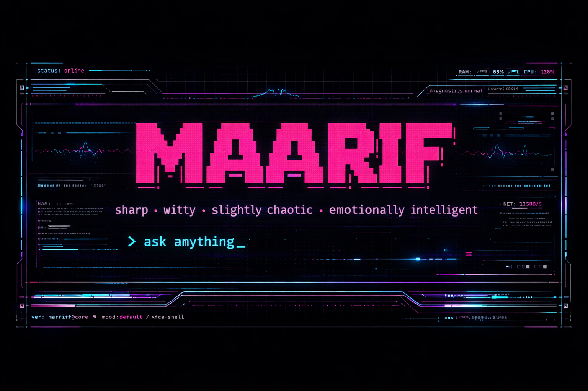
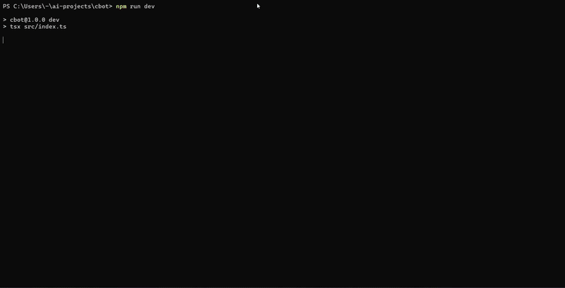
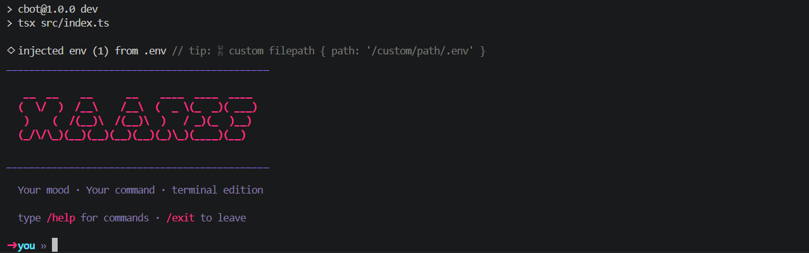
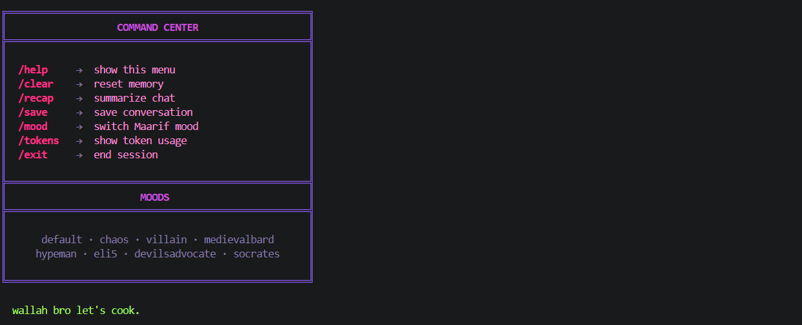
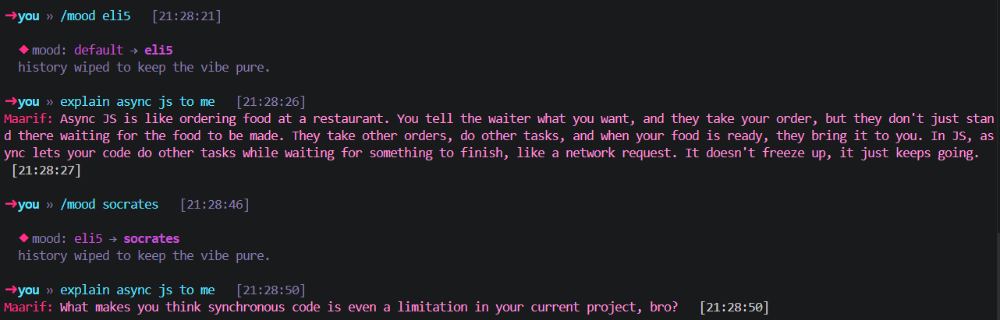
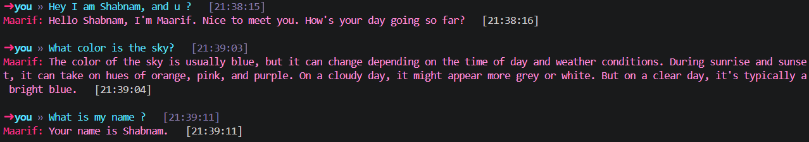
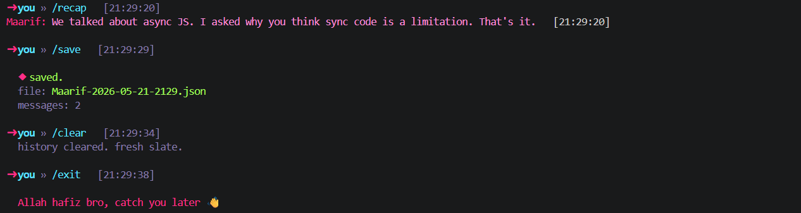

<div align="center">



<br/>

# ✦ MAARIF ✦

### _halal chaos · terminal edition_

<p align="center">
  A personality-driven AI CLI chatbot powered by Groq streaming, custom moods, and cinematic terminal aesthetics.
</p>

<br/>

<p align="center">
  
  
  
  
  
</p>

<br/>



</div>

---

# ✦ Overview

**Maarif** is a personality-first AI terminal chatbot built with **TypeScript**, **Groq SDK**, and streaming responses.

Unlike traditional CLI assistants, Maarif focuses heavily on:

- terminal aesthetics
- mood-based personality systems
- conversational realism
- fast streaming interaction
- immersive command-line UX

Every mood is still the same identity — _Maarif_ — but expressed differently.

The project combines:

- AI streaming
- prompt engineering
- terminal UI design
- memory handling
- custom commands
- conversational tone systems

into a polished developer-focused CLI experience.

---

# ✦ Features

### ✦ Real-Time Streaming Responses

Powered by Groq streaming for instant token-by-token replies.

### ✦ Dynamic Mood System

Switch Maarif's personality in real time.

Available moods:

- default
- chaos
- villain
- medievalbard
- hypeman
- eli5
- devilsadvocate
- socrates

### ✦ Cinematic Terminal UI

Custom terminal styling with:

- neon color themes
- boxed command panels
- ASCII banners
- live timestamps
- clean spacing
- premium CLI layout

### ✦ Persistent Conversation Context

Maintains conversational memory throughout the session.

### ✦ Token Usage Tracking

Monitor total session token consumption.

### ✦ Conversation Recap System

Generate summarized recaps of ongoing conversations.

### ✦ JSON Conversation Export

Save full chat history locally.

### ✦ Built with TypeScript

Fully typed architecture with modular organization.

---

# ✦ Tech Stack

| Technology      | Usage                    |
| --------------- | ------------------------ |
| TypeScript      | Core language            |
| Node.js         | Runtime                  |
| Groq SDK        | AI inference + streaming |
| Chalk           | Terminal styling         |
| Figlet          | ASCII banners            |
| Gradient String | Terminal gradients       |
| TSX             | Development runtime      |

---

# ✦ AI Model

```ts
llama-3.3-70b-versatile
```

Powered using:

- Groq SDK
- Streaming completions
- Real-time token rendering

---

# ✦ Personality System

Maarif is designed around a **single consistent identity**.

The moods do not create different characters.

Instead:

- each mood amplifies different traits
- while preserving the same personality core

This creates:

- consistency
- realism
- recognizable conversational behavior

The system prompt architecture includes:

- core personality layer
- modular mood overlays
- response-style constraints
- tone controls
- humour rules
- conversational behavior tuning

---

# ✦ Screenshots

## ✦ Welcome Screen



---

## ✦ Command Center



---

## ✦ Mood System



---

## ✦ Memory Handling



---

## ✦ Recap · Save · Clear · Exit



---

## ✦ Token Tracking


---

# ✦ Installation

## Clone Repository

```bash
git clone https://github.com/Shabnam-Fatma/cbot.git
cd cbot
```

---

## Install Dependencies

```bash
npm install
```

---

## Setup Environment Variables

Create a `.env` file:

```env
GROQ_API_KEY=your_api_key_here
```

---

## Start Development Server

```bash
npm run dev
```

---

# ✦ Commands

| Command   | Description             |
| --------- | ----------------------- |
| `/help`   | Show command menu       |
| `/clear`  | Reset chat memory       |
| `/recap`  | Summarize conversation  |
| `/save`   | Export chat history     |
| `/mood`   | Switch personality mode |
| `/tokens` | Show token usage        |
| `/exit`   | Exit Maarif             |

---

# ✦ Example Usage

```bash
➜ you » explain recursion like i'm five

Maarif: imagine a function holding a tiny mirror in front of itself bro.
every time it looks, it sees another version doing the same thing.
```

---

# ✦ Project Structure

```bash
src
├── commands
├── core
│   └── stream.ts
├── moods
│   └── prompts.ts
├── utils
├── config.ts
├── chat.ts
├── index.ts
└── types.ts
```

---

# ✦ Streaming Architecture

Maarif streams responses token-by-token using the Groq SDK.

Key features:

- low latency generation
- live rendering
- real-time output updates
- streaming token tracking

Implementation highlights:

- async iterable stream handling
- incremental terminal rendering
- accumulated response buffering
- session token monitoring

---

# ✦ Terminal Design Philosophy

The UI design focuses on making the terminal feel:

- immersive
- cinematic
- expressive
- modern
- personality-driven

The visual system uses:

- neon pink accents
- soft purple borders
- cyan user prompts
- boxed layouts
- breathing room
- layered spacing

instead of traditional minimalist terminal styling.

---

# ✦ Future Improvements

- local chat history database
- markdown rendering
- slash command autocomplete
- voice interaction
- plugin system
- custom themes
- animated loaders
- multi-model support
- local model integration
- personality editor

---

# ✦ Why This Project Exists

Most AI CLIs feel:

- robotic
- generic
- visually dull
- personality-less

Maarif was built to explore:

> “What if a terminal assistant actually felt alive?”

The project experiments with:

- conversational identity
- emotional tone systems
- CLI aesthetics
- streaming UX
- human-like interaction patterns

while remaining lightweight and developer-friendly.

---

# ✦ Author

<div align="center">

## Shabnam Fatma

GitHub:

### https://github.com/Shabnam-Fatma

</div>

---

# ✦ License

MIT License.

---

<div align="center">

### ✦ built with halal chaos ✦

</div>
